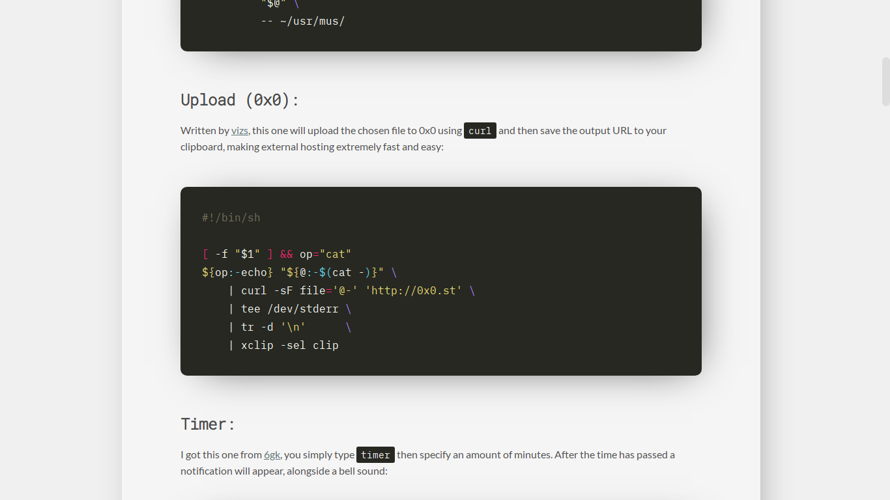

<h1 align="center">hugo-theme-nuance</h1>

<p align="center"



</p>

## Installation
First, clone this repository into your `themes/` folder from the root of your Hugo site:
```sh
git clone https://github.com/co1ncidence/hugo-theme-nuance.git themes/hugo-theme-nuance
```
Once you've done that, copy over the example configuration file and modify to your needs:
```sh
cp themes/hugo-theme-nuance/exampleSite/config.toml .
```

## Adding Menus
Say you wanted to make a menu called "rices" that had it's own page, you would add this to `config.toml` under the other menus:
```toml
  [[menu.main]]
    name = "Rices"
    identifier = "rices"
    url = "/rices/"
    weight = 4
```
Then you would create a new folder for this page:
```sh
mkdir content/rices/
```
Finally, add the index page using Hugo:
```sh
hugo new rices/index.md
```
Now whatever you put in `index.md` will show in the page generated by your new menu link.
